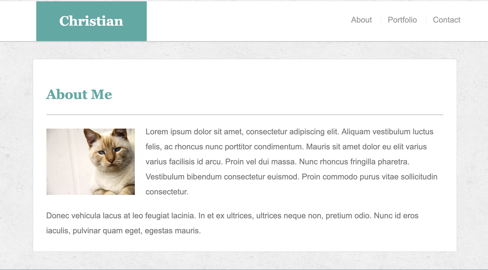

# Bootstrap Portfolio Template 

Simple responsive portfolio template outline made with the Bootstrap grid system, and its components. 

## Information

This simple template was made purely with HTML and CSS while utilizing Bootstrap. This template was made to be responsive for all screen sizes. It was a HW assignment for the UA Full Stack Web Development BootCamp. 

## Usage

If you would like to use this portfolio template, please feel free to clone or download this template to your local machine

## Preview

